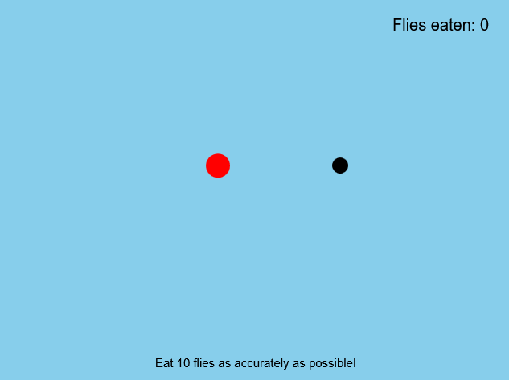
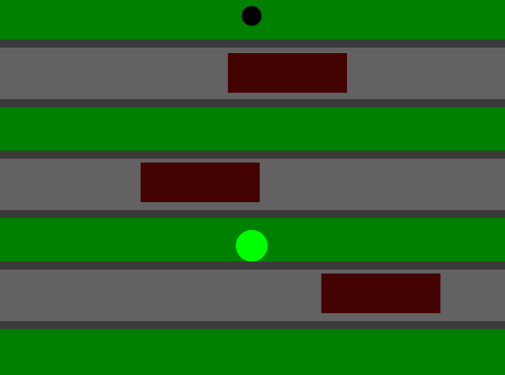
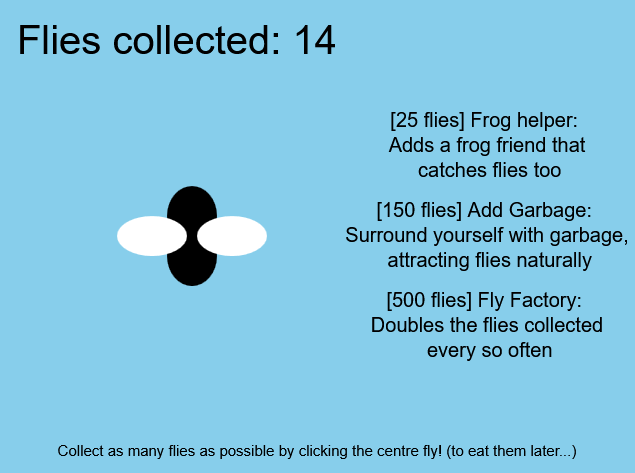

# FrogFrogFrog Variations

Daniel Michurov

[View this project online](https://cakeallen.github.io/cart253/variations-jam/index.html)

## Description

I have made three different variations of FrogFrogFrog:

1. First Person FrogFrogFrog: Puts you in the eyes of the frog trying to snip some flies out of mid-air. 

2. FroggerFroggerFrogger: Turns the game into frogger where you have to cross the road full of moving vehicles to get the flies.

3. Fly Clicker: You get a button and every time you click it, you collecta fly. After a few flies, you get upgrades which give you even MORE flies. Normally, the player would have to click on the upgrades to get them, but for simplicity's sake, i just made it automatic.

## Screenshot(s)

# First Person FrogFrogFrog
> 

# FroggerFroggerFrogger
> 

# Fly Clicker
> 

## Attribution

This bit should attribute any code, assets or other elements used taken from other sources. For example:

> - This project uses [p5.js](https://p5js.org).

## License

> This project is licensed under a Creative Commons Attribution ([CC BY 4.0](https://creativecommons.org/licenses/by/4.0/deed.en)) license with the exception of libraries and other components with their own licenses.